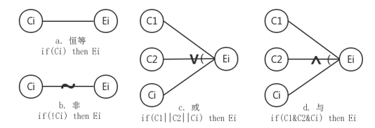
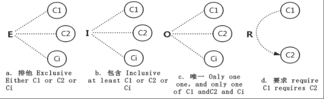
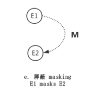
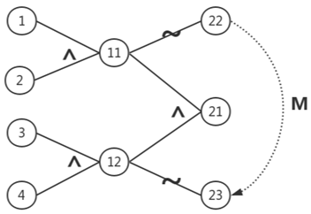
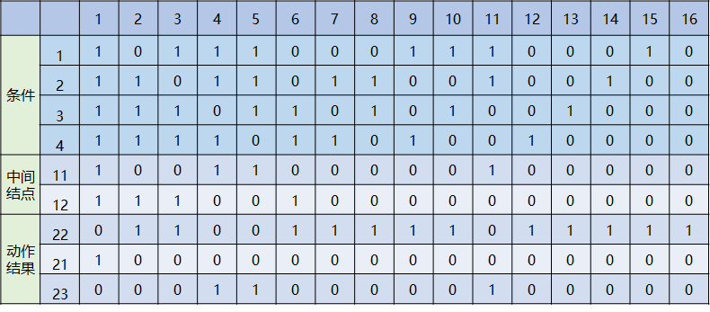
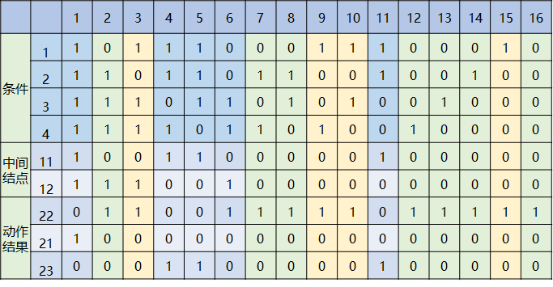
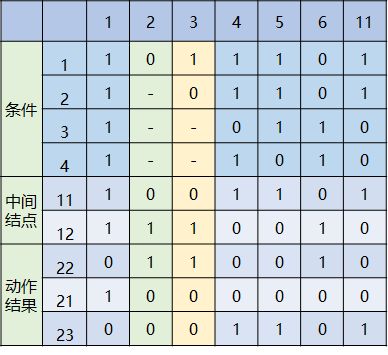

# 测试用例编写

## 一、黑盒测试法

### 1.1 等价类划分法

概念： 把入参划分为两类：有效等价类和无效等价类，从数据范围中任选一个代表这一类进行测试

应用场景： 有数据输入就可以有等价类划分

- 有效等价类： 符合需求说明，合理的输入数据集合
- 无效等价类： 不符合需求说明，无意义的输入数据集合

### 1.2 边界值分析法

概念： 对于输入或输出的边界值进行测试

应用场景： 

- 有数据输入或输出就可以使用
- 常与等价类划分一起使用，如有效数据和无效数据的分界点

`ep`:　最大可提： 1000.00港币

有效边界值：999.99 、 无效边界值：1000.01

### 1.3 因果图法

概念： 利用图解法分析输入的各种组合情况，从而设计用例来检查程序输入条件的组合情况

应用场景:

- 界面有多个操作，操作和操作之间有一定的组合关系和限制关系
- 不同的组合会产生不同的输出结果

步骤：

1. 分析需求中的输入、输出，找出原因、结果
2. 分析需求中的语义，找出关系
3. 分析需求中实际不可能出现的，标明约束条件
4. 把因果图转化为判定表
5. 把表中每一类所表示情况设计成测试用例

因果图法基本关系：

原因-->结果：恒等(`if reason then result`),  非(`if !reason then result`), 或(`if r1|r2|r3 then result`), 与(`if r1&r2&r3 then result`)

原因-->结果： 互斥(E)、包含(I)、唯一(O)、要求(R)、屏蔽(M)

`eq`:统一购买力账户取消关联时，要求关联中的2个子账户（港股子账户+美股子账户）无挂单，且风控水平线在Margin Call线之上，即满足：1）当前无挂单 2）`ELV-MCM` > 0。

不满足条件1，则提示失败1：“请您取消各个账户中的未成交订单后重试”；

不满足条件2，则提示失败2：“取消关联失败，您需要补足子账户追缴保证金…

1、根据题意，原因和结果如下：

原因： 																		结果：

​		`1`港股子账户当前无挂单 											  22 取消关联成功	

​		`2`美股子账户当前无挂单											   21给出失败1 的报错信息	

​		`3`美股子账户`ELV-MCM >0`                                            23 给出失败2的报错信息

​		`4`港股子账户`ELV-MCM >0`

2、其对应的因果图如下

​		

3、根据因果图建立判定表

4、写测试用例

### 1.4 判定表法

概念：判定表法是分析和表达**多**逻辑条件下执行不同操作的工具

**判定表组成：**

- 条件桩： 列出所有条件，列出条件的次序无关
- 动作桩： 列出所有操作， 操作的排列顺序无关
- 条件项： 列出所有条件的取值组合
- 动作项： 列出在条件项各种取值情况下采取的动作

**规则：**

- 任何一个条件组合的特定取值及相应操作称为规则
- 判定表中贯穿条件项和动作项的一列就是一条规则

**应用场景：**

- 多个条件决定一个动作
- 并且每个条件的取值只有两种
- 且条件和动作之间的逻辑关系明确

**步骤**

- 列出所有的条件和动作
- 确定规则的个数
- 填写判定表
- 化简判定表

`eq`： 同上因果图法

1、列出所有的条件和动作

条件： 																		动作：

​		`1`港股子账户当前无挂单 											  22 取消关联成功	

​		`2`美股子账户当前无挂单											   21给出失败1 的报错信息	

​		`3`美股子账户`ELV-MCM >0`                                            23 给出失败2的报错信息

​		`4`港股子账户`ELV-MCM >0`

2、确定规则个数：

​	4个条件，每个条件有两个取值，有16种规则

3、填写判定表并化简

### 1.5 正交实验法

**概念：**从**大量的数据**中挑选**适量的、有代表性的**点,合理地安排测试的一种设计方法

**构成：**

行数(Runs)：正交表中的行的个数，即试验的次数

因素数(Factors)：正交表中列的个数，即要测试的变量数

水平数(Levels)：任何单个因素能够取得的值的最大个数

表示形式： L行数(水平数因素数)

**应用场景：**

- 一个界面有多个控件，每个控件有多个取值
- 不同控件不同取值之间的组合结果上百，需挑选典型的代表测试

**步骤 ：**

1. 提取功能说明，构造因子-状态表
   - 影响实验指标的条件称为因子
   - 影响实验因子的条件称为因子的状态
2. 加权筛选生成因素分析表
   - 按照重要程序分别加权，选择因子与状态
   - 根据各个因子及状态的作用大小、出现频率的大小以及测试的需要确定权值的大小
3. 利用正交表构造测试数据集

### 1.6 功能图法

概念：

- 功能图有**状态迁移图**和**布尔函数**组成
- 状态迁移图用状态和迁移来描述
- 状态指出数据输入的位置或时间
- 迁移指明状态的改变

应用场景：

- **对于较复杂的程序，存在大量的组合情况**
- 动态说明描述输入数据的次序或转移的次序
- 静态说明输入条件与暑促条件之间的对应关系
- 用静态说明往往是不够的，必须用动态说明来补充用例

步骤：

- 画出状态迁移图
- 列出状态—事件表
- 列出状态转换树
- 推出测试路径
- 根据测试路径编写测试用例

### 1.7 错误推测法

概念： 根据以往的测试经验和对系统内部知识的了解，列出系统中可能存在的错误和容易发生的错误的情况

应用场景：

熟悉系统薄弱的地方，根据以往的缺陷分析报告作为推测的依据，分析系统最容易出现错误的地方

### 1.8场景分析法

概念： 运用场景对系统的功能点过业务流程的描述来测试的一种方法。

模拟特定场景边界发生的事情，通过事件来触发动作的发生，观察事件的最终结果

**应用场景：**

•界面中没有太多填写项，操作主要通过鼠标单（双）击、拖拽等完成

•业务逻辑较复杂的程序，模拟用户所有正确操作和所有错误操作

## 二、测试方法选择策略

1. 首先使用等价类划分，包括输入条件和输出条件的等价划分
2. 在任何情况下，都必须使用边界值分析法，它发现程序错误的能力最强
3. 使用错误推测法追加一些测试用例，需要依靠测试工程师的经验
4. 对照程序逻辑，检查已设计出的测试用例的覆盖程度，再补充足够的测试用例
5. 如果程序的功能说明中含有**输入条件的组合**情况，则选用**因果图法和判定表驱动法**
6. **参数配置类**的软件，用**正交实验法**选择较少的组合方式达到最佳效果
7. 利用功能图法，通过不同时期的有效性设计不同的测试用例
8. 业务流清晰的系统，利用场景法贯穿整个测试设计过程

## 三、常用白盒测试方法

总体上白盒测试方法分为**静态方法**和**动态方法**两大类

### 3.1 代码监察法

### 3.2 静态结构分析法

### 3.3 静态质量度量法

### 3.4 逻辑覆盖法

其中逻辑覆盖包括语句覆盖、判定覆盖、条件覆盖、判定/条件覆盖、条件组合覆盖和路径覆盖。

**六种覆盖标佳发现错误的能力呈由弱到强的变化:**

1.语句覆盖每条语句至少执行一次。

2.判定覆盖每个判定的每个分支至少执行—次。

3.条件覆盖每个判定的每个条件应取到各种可能的值。

4.判定/条件覆盖同时满足判定覆盖条件覆盖。

5.条件组合覆盖每个判定中各条件的每一种组合至少出现一次。

6.路径覆盖使程序中每条可能的路径至少执行一次。

### 3.5 基本路径测试法

### 3.6 其他